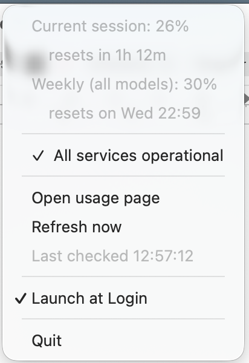

# Claude Usage — macOS menu-bar meter

A tiny menu-bar app that shows your Claude subscription usage as **two
percentages** in the menu-bar title — `<session>% · <weekly>%`, the same numbers
as [claude.ai/settings/usage](https://claude.ai/settings/usage):

- **First number** → current **session** (the rolling 5-hour window).
- **Second number** → **weekly**, all models (the rolling 7-day window).



The dropdown shows each percentage, its reset time, the Claude service status,
*Open usage page*, *Refresh now*, the last-checked time, *Launch at Login*,
*About*, and *Quit*. When a meter first crosses a threshold (default 80%) you get a
Notification Centre banner.

The **About** row names the build — `About Claude Usage v2.0.0` — and opens that
version's release notes when clicked. Its tooltip carries the commit, the build
date and the architecture, which is what a bug report actually needs: the released
archives are Apple silicon only, and these builds are unsigned, so "which build is
that?" is otherwise unanswerable. `make-app.sh` stamps all three in from
`git describe`, so an untagged build says `v1.2.0-3-g1a2b3c4` and a dirty tree says
`-dirty`; `go run .` says `dev`.

## Service status

Every poll also reads [status.claude.com](https://status.claude.com). While it
reports anything other than *All Systems Operational*, a **red dot** appears in
front of the percentages (`🔴 12% · 34%`) and the dropdown grows an outage
section:

- a headline row — `●  Partial System Outage` — which opens status.claude.com;
- one row per ongoing incident (and per in-progress maintenance), labelled
  `Investigating — <incident>`; hovering shows the newest update, clicking opens
  that incident on the status page;
- an *Affected:* row listing the components that are not operational.

The dot **blinks** while the outage is unacknowledged, and goes **solid** once you
open the menu — so a new disruption catches your eye, then stops nagging. A later,
different incident starts it blinking again. While blinking, the off phase is a
transparent image of the same size rather than no image at all, so the
percentages stay put instead of shifting twice a second.

When everything is fine the dot disappears entirely and the section collapses to a
single `✓  All services operational` row. The status page needs no credentials, so
the dot keeps working even while the OAuth token is expired.

## Polling rates, and the rate limit

The usage endpoint rate-limits at roughly **one request per two minutes per
token**. At the original 60 s poll interval every *other* call came back
`429 rate_limit_error`, which the menu reported as a bare "Last check failed" —
so the app looked broken while nothing was actually wrong.

The two sources are therefore paced separately:

- **status.claude.com** — no credentials, no limit — every `POLL_SECONDS` (60 s),
  so the outage dot stays responsive.
- **the usage endpoint** — every `USAGE_SECONDS` (150 s, floor 120 s; a smaller
  value would only produce 429s, so it is refused).

When a 429 does arrive it is treated as expected rather than as a failure: the
percentages stay on screen, the menu says *"Rate limited; retrying 12:34:56"*, and
the wait doubles up to 15 minutes until a call succeeds. The server's `Retry-After`
is honoured when it asks for longer — it is usually `0`, and there are no
rate-limit budget headers, so the client has to impose its own spacing. Genuine
failures now name their reason instead of just "failed".

*Refresh now* ignores the pacing and calls the endpoint immediately, on the basis
that asking explicitly should do something; if that lands inside the limit you get
the rate-limited row rather than silence.

## How it works

Every `USAGE_SECONDS` it queries `https://api.anthropic.com/api/oauth/usage` —
the same internal endpoint the claude.ai usage page calls — using Claude Code's
stored OAuth token (read from the macOS Keychain, falling back to
`~/.claude/.credentials.json`). It reads the two windows by their **stable**
upstream keys — `five_hour` and `seven_day` — so renamed labels or new internal
codename windows never break it. (There is no officially documented API for this;
see [anthropics/claude-code#13585](https://github.com/anthropics/claude-code/issues/13585).)

## ⚠️ OAuth token & refresh — read this

The app is **read-only**: it uses whatever OAuth token Claude Code has stored
and **never refreshes or writes it**. That token expires roughly hourly, and only
running the `claude` CLI refreshes it. So:

- While the token is valid, the numbers refresh every `USAGE_SECONDS` as expected.
- Once it expires, every poll returns "token expired", the title shows **"⚠"**,
  the numbers stop updating, and the menu shows **"⚠ OAuth token expired — run a
  Claude Code command to refresh"** until you next use Claude Code.

For an always-on meter this is the main limitation — see the design note below
for why it's deliberate and how to lift it.

## Design decision: read-only credentials, no auto-refresh

This app **only reads** the OAuth token Claude Code already stored, and **never
writes credentials, refreshes tokens, or runs its own auth flow**. That is a
deliberate choice, not an oversight. Strategies that were considered and
**intentionally not** implemented:

1. **Refreshing the token and writing it back to the Keychain.** This is the
   obvious way to get an always-on meter, but it makes the app a *writer* of the
   credentials Claude Code owns.
2. **Shelling out to `claude` to force a refresh.** Spawning the CLI on a timer
   to piggyback on its refresh would work but is heavyweight and surprising
   (background CLI invocations, possible prompts, log noise).
3. **Running a standalone OAuth login / using a separate API key.** Giving the
   app its own independent credential decouples it from Claude Code entirely, but
   is a much larger surface (browser login flow, secure storage, its own token
   lifecycle) for what is meant to be a passive read-only meter.

**Why read-only is the default.** The credentials belong to Claude Code. Writing
them back risks racing with Claude Code's own refresh (last writer wins → either
side can clobber the other's fresh token and break the session), and the refresh
flow is **undocumented** (endpoint, `client_id`, and grant shape are all internal
and can change without notice). A meter silently corrupting your login is a far
worse failure than a meter that shows `⚠` for a few minutes until you next touch
Claude Code. So the app stays a passive observer.

### Implementing auto-refresh later (if-need-be)

If the read-only limitation becomes painful, option 1 above is the path. Notes so
it can be picked up without re-deriving everything:

- **The refresh token is already on disk**, next to the access token. The cred
  blob (`credBlob` in `internal/usage/usage.go`) currently reads only
  `claudeAiOauth.accessToken` and `claudeAiOauth.expiresAt`; the same object also
  carries `claudeAiOauth.refreshToken` (and `scopes`). Add a `RefreshToken` field
  to read it.
- **The flow:** in `Fetch`, when the token is expired (or within ~a minute of
  `expiresAt`), POST a `grant_type=refresh_token` request to Anthropic's OAuth
  **token** endpoint (the one Claude Code itself uses — *confirm the exact URL,
  `client_id`, and body by reading Claude Code's source or observing its refresh
  request; none of this is officially documented*). On success you get a new
  `accessToken`, `refreshToken`, and `expiresAt`.
- **Write it back to the same place you read it from**, preserving *every* field
  in the JSON (don't drop `scopes` etc.):
  - Keychain: `security add-generic-password -U -s "Claude Code-credentials" -a <account> -w <json>` (the `-U` updates in place). Read the existing account name first.
  - File fallback: rewrite `~/.claude/.credentials.json` with `0600` perms.
- **Mind the race.** Claude Code may refresh concurrently. Refresh only when
  actually expired, re-read immediately before writing, and treat a `401` after a
  fresh write as "Claude Code already rotated it — re-read and retry once".
- **Keep it opt-in.** Gate it behind an env var (e.g. `AUTO_REFRESH=1`) so the
  default install stays read-only and can never touch your credentials.

## Build & run

Requires Go 1.22+ (this repo pins `golang 1.25.11` via `.tool-versions`).

```sh
# Run in the foreground (Ctrl-C to stop):
go run .

# Build the .app, and let it offer to install:
./build/make-app.sh
```

`make-app.sh` produces `Claude Usage.app` with `LSUIElement=true` (menu-bar-only,
no Dock icon). After building it asks *"Install to /Applications and relaunch?"*,
which quits whichever copy is running (the installed one or one launched from this
repo — they share a bundle id), replaces the bundle, and reopens it from
`/Applications`. Pass `--install` or `--no-install` to answer up front; with no
terminal on stdin it builds and stops rather than touching `/Applications`.

Installing this way is worth preferring, because *Launch at Login* records the
bundle by the path it was registered from — see below.

## Configuration

| Env var         | Default | Meaning                                                        |
| --------------- | ------- | -------------------------------------------------------------- |
| `POLL_SECONDS`  | `60`    | Status-page interval in seconds (min 10).                      |
| `USAGE_SECONDS` | `150`   | Usage-endpoint interval in seconds (min 120 — see below).      |
| `ALERT_PERCENT` | `80`    | Banner when a meter first reaches this %. `0` disables alerts. |
| `STATUS_URL`    | `https://status.claude.com/api/v2/summary.json` | Statuspage summary document to poll for the outage dot. |

## Launch at login

The app offers this itself: the first time you run it from the `.app` bundle it
asks *"Launch Claude Usage at login?"*, and choosing **Launch at Login**
registers the bundle as a login item via `SMAppService` (macOS 13+). It then
appears under System Settings → General → Login Items → **Open at Login**, and
you can switch it off there.

Register the copy that is going to stay put — macOS remembers the bundle by the
path it was registered from, so install to `/Applications` *first* and answer the
prompt from that copy. Answering it from the repo build means the next
`make-app.sh` (which does `rm -rf` on the bundle) leaves a dangling login item.

The offer is made once, either way. The answer is remembered in
`~/Library/Application Support/dk.biq.claudeusage/launch-at-login`; delete that
file to be asked again. It is also skipped when the binary isn't running from a
bundle (`go run .`), since login items are bundles.

Each launch also *reconciles*: if the record says registered, the app registers
again. That is a no-op when it already is, and it repairs the case where the login
item was dropped — which happens whenever the bundle is replaced, as
`make-app.sh --install` does. If macOS instead reports the item as switched off,
that is left alone: it means someone turned it off in System Settings, and the
checkbox will show unticked until you tick it again.

Three notes on the mechanics:

- **The bundle is ad-hoc signed with its own identifier.** The Go linker already
  ad-hoc signs, but it calls every binary it produces `a.out`, and macOS keys
  login items by signing identity — so two unsigned Go apps look like one item and
  registering either one evicts the other's *Open at Login* entry. `make-app.sh`
  runs `codesign --sign - --identifier <bundle id>` to give each build a distinct,
  stable identity. That buys identity, not trust: these builds are still not
  Developer ID signed and not notarised.

- A launchd job in `~/Library/LaunchAgents` also starts the app at login, but
  macOS classifies it as a *background item*, so it lands under **App Background
  Activity** instead — labelled "Item from unidentified developer", since these
  builds are unsigned. `build/dk.biq.claudeusage.plist` is kept as that manual
  alternative.
- `SMAppService.mainApp.status` cannot be used to decide whether to ask: it
  reports `enabled` for a bundle that has *never* been registered, and only says
  `notRegistered` once something has explicitly unregistered it. Hence the local
  state file above.

To set it up by hand instead:

- **Login Items** — System Settings → General → Login Items → add
  `Claude Usage.app`; or
- **LaunchAgent** — copy `build/dk.biq.claudeusage.plist` to
  `~/Library/LaunchAgents/`, fix the path inside if the app isn't in
  `/Applications`, then
  `launchctl load ~/Library/LaunchAgents/dk.biq.claudeusage.plist`.

## Project layout

```
main.go                 systray wiring, poll loop, menu, threshold banners
internal/usage/         read OAuth token + query endpoint, parse stable keys → two meters
internal/status/        poll status.claude.com summary API → indicator, incidents, components
internal/icon/          the red status dot, drawn programmatically (no binary assets)
internal/login/         open-at-login registration via SMAppService (cgo)
internal/notify/        Notification Centre banner + confirm dialog via osascript
build/                  Info.plist, make-app.sh, LaunchAgent plist
third_party/systray/    vendored fork of fyne.io/systray (see below)
```

The app pins a **local fork of `fyne.io/systray`** under `third_party/systray`,
wired in via a `replace` directive in `go.mod`. The only change is a one-method
patch to `show_menu` in `systray_darwin.m`: it attaches the menu to the status
item and triggers it via the button so AppKit positions the dropdown directly
below the menu bar. Upstream pops the menu at the button's zero origin, which
renders it *over* the menu-bar icons until a mouse move forces a relayout. To
re-sync the fork to a newer upstream, re-copy it from the module cache and
re-apply that patch.

## Testing

```sh
go test ./...   # unit tests (offline)

# Opt-in diagnostics against the live endpoints:
go test -tags livetest -run TestLiveFetch  -v ./internal/usage   # needs a valid OAuth token
go test -tags livetest -run TestLiveStatus -v ./internal/status  # needs network only
```

To see the outage UI without waiting for a real incident, point `STATUS_URL` at a
saved summary document served locally (e.g. `python3 -m http.server`) with the
`status.indicator` field set to something other than `none`.

## Notes & possible extensions

- **Auto-refresh** — the most useful next step for unattended running; see
  [Design decision: read-only credentials](#design-decision-read-only-credentials-no-auto-refresh)
  for why it's off by default and how to add it.
- **Two-line display** — MenuMeters-style stacked numbers aren't possible through
  stock `fyne.io/systray` (it force-sizes icon images to 16×16), so the title is a
  single line. A stacked variant would need a custom `NSStatusItem` view — an
  extension of the fork already vendored under `third_party/systray`.
- **More windows** — the endpoint also returns Sonnet/Opus and rotating internal
  codename windows; the title could grow more numbers, but two keeps the
  menu-bar footprint small.

## License

This project is licensed under the [MIT License](LICENSE).

It vendors a fork of [`fyne.io/systray`](https://github.com/fyne-io/systray)
under `third_party/systray/`, which is licensed under the Apache License 2.0 and
retains its own [`LICENSE`](third_party/systray/LICENSE).
